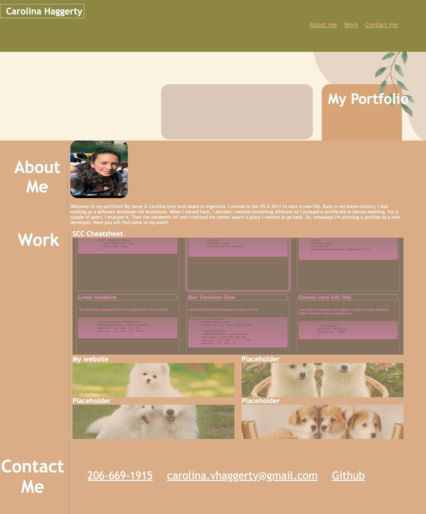

# My Portfolio Webpage
 I built this webpage to be able to showcase the work I have done and will do through my career. In the time, I built this I came across a lot of challenges and set back but I kept looking for help and information outside of what I knew and learned from class. 
 
 I also sought help from various websites like Developer.mozilla.org , w3schools.com, 
 css-tricks.com. I was able to get my cover picture from wallpapers.com and my background theme from visme.com.

 Here are pictures of the my website in different views. 

 
 

# Links to my Github and live website:

## Github: https://github.com/caroHagg

## Website:  https://carohagg.github.io/My-Portfolio

